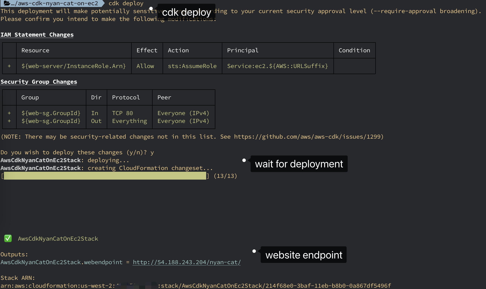

# Welcome to aws-cdk-nyan-cat-on-ec2

This is a nyan-cat page stored in EC2 Instance writen in TypeScript development with CDK.

## Steps

Deploy with `cdk deploy`, and hold the seconds, the endpoint of website would print out.

The EC2 Instance would take some times, the endpoint would show out.

After that, remember to clean up this stack with `cdk destory`.

## Reference

* web page for nyan-cat [cristurm/nyan-cat](https://github.com/cristurm/nyan-cat)